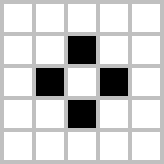

# Conway's Game of Life

## Table of Contents
- [Introduction](#introduction)
- [Rules](#rules)
- [Examples of Patterns](#examples-of-patterns)
- [References](#references)

## Introduction

Conway's Game of Life is a cellular automaton devised by mathematician John Conway in 1970. It is a zero-player game, meaning that its evolution is determined by its initial state, with no further input from humans. Despite its elementary principles, the Game of Life is a captivating demonstration of emergent complexity from minimalistic rules.
 
## Rules

The Game of Life is played on a grid of cells, where each cell can be in one of two states: alive or dead. The game evolves in turns, following these rules:

1. **Birth**: A dead cell with exactly three live neighbors becomes a live cell.
2. **Survival**: A live cell with two or three live neighbors survives.
3. **Underpopulation**: A live cell with fewer than two live neighbors dies. 
4. **Overpopulation**: A live cell with more than three live neighbors dies. 

The initial pattern constitutes the seed of the system. The first generation is created by applying the above rules simultaneously to every cell in the seed and continue to be applied repeatedly to create further generations.

## Examples of Patterns

Many different types of patterns occur in the Game of Life, classified according to their behavior. Here are some common pattern types:

- **Still Lifes**: Patterns that do not change from one generation to the next one.
- **Oscillators**: Patterns that return to their initial state after a finite number of generations.
- **Spaceships**: Patterns that translate themselves across the grid.

Frequently occurring examples of the three aforementioned pattern types are: 

|                                  Still Lifes                                       |                                  Oscillators                                        |                                      Spaceships                                            |
|:----------------------------------------------------------------------------------:|:-----------------------------------------------------------------------------------:|:------------------------------------------------------------------------------------------:|
|        Block   |    Blinker |           Glider     |
|    Beehive |          Toad    |    Lightweight Spaceship |
|     Flower   |     Beacon   |    Heavyweight Spaceship |

## References

For the development of this project, I based my work on various resources:

- [Wikipedia](https://en.wikipedia.org/wiki/Conway%27s_Game_of_Life): Conway's Game of Life.
- [The Coding Train](https://www.youtube.com/watch?v=FWSR_7kZuYg): Coding Challenge #85: The Game of Life.
- [Science Etonnante](https://www.youtube.com/watch?v=S-W0NX97DB0): Le Jeu de la Vie.
- [Conway's Game of Life Community](https://conwaylife.com/): A community for Conway's Game of Life and related cellular automata.
